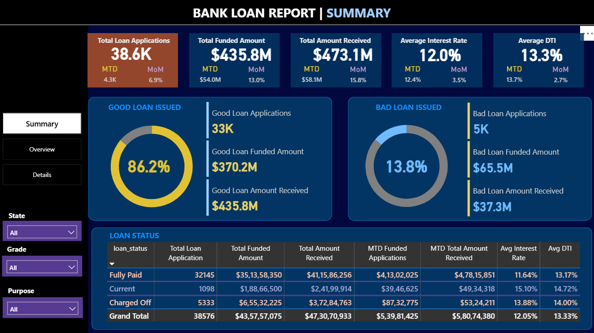
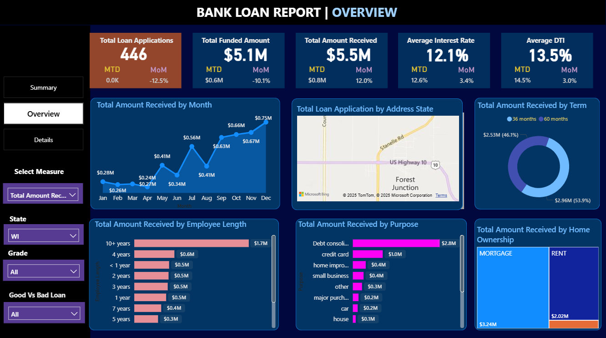
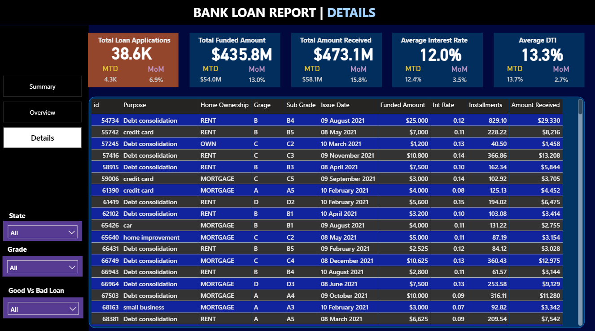

# 🏦 Bank Loan Analysis Dashboard

[](https://powerbi.microsoft.com/)
[](https://github.com/vinayak200227/Bank-Loan-Analysis-using-PowerBI)

> 📊 **Transform raw banking data into actionable insights with interactive Power BI dashboards**

## 🎯 What This Project Does

Ever wondered how banks make lending decisions? This Power BI project takes complex loan data and transforms it into crystal-clear visualizations that tell the complete story of a bank's lending operations.

### 🚀 Key Features

- **Real-time KPI tracking** with Month-over-Month comparisons
- **Interactive dashboards** for exploring loan trends and patterns
- **Geographic analysis** showing regional lending hotspots
- **Risk assessment tools** with debt-to-income ratio analysis
- **Comprehensive loan portfolio overview** at your fingertips

---

## 📋 The Three-Dashboard Journey

### 🏠 Dashboard 1: **Summary** - Your Command Center
*Get the big picture in seconds*

**📈 Key Metrics at a Glance:**
- 💰 **Total Loan Applications** - Track volume with MTD and MoM changes
- 💸 **Total Funded Amount** - Monitor disbursed funds
- 📥 **Total Amount Received** - Cash flow from loan repayments
- 📊 **Average Interest Rate** - Market positioning analysis
- ⚖️ **Average Debt-to-Income Ratio** - Risk assessment overview

**🎯 Special Feature:** Loan Status Grid View
> A comprehensive snapshot of your entire lending operation categorized by loan performance status

### 🗺️ Dashboard 2: **Overview** - Discover Patterns
*Where the data tells its story*

- **📅 Monthly Trends** (Line Chart) - Spot seasonal patterns and growth trends
- **🌍 Regional Analysis** (Interactive Map) - Discover your geographical lending footprint  
- **⏰ Loan Term Distribution** (Donut Chart) - Visualize loan duration preferences
- **👔 Employment Length Impact** (Bar Chart) - How job stability affects lending
- **🎯 Loan Purpose Breakdown** (Bar Chart) - What drives borrowing decisions
- **🏡 Home Ownership Analysis** (Tree Map) - Property ownership vs. loan behavior

### 🔍 Dashboard 3: **Details** - Deep Dive Central
*When you need the complete picture*

Your one-stop destination for detailed loan metrics, borrower profiles, and performance analytics. Perfect for:
- ✅ Due diligence and compliance reporting
- 🎯 Risk assessment and mitigation strategies  
- 📊 Portfolio optimization decisions
- 🔍 Individual loan performance tracking

---

## 🛠️ Getting Started

### Prerequisites
- 💻 Power BI Desktop installed on your machine
- 📁 Git for cloning the repository

### Quick Setup (3 easy steps!)

1. **📥 Clone the Repository**
   ```bash
   git clone https://github.com/vinayak200227/Bank-Loan-Analysis-using-PowerBI.git
   ```

2. **🚀 Open Power BI Project**
   - Launch Power BI Desktop
   - Open the `.pbix` file from the cloned repository

3. **🎮 Start Exploring!**
   - Navigate through the three dashboards
   - Interact with filters and visualizations
   - Discover insights hidden in your data

---

## 📸 Dashboard Previews

### 📊 Summary Dashboard
*Your executive overview*


### 🔄 Overview Dashboard  
*Patterns and trends visualization*


### 📋 Details Dashboard
*Comprehensive data exploration*


---

## 📊 Dataset Information

**What's Inside the Data:**
- 🆔 **Loan ID** - Unique loan identifiers
- 📍 **Geographic Data** - State-wise loan distribution
- 🎯 **Loan Purpose** - Why people borrow money
- 📈 **Credit Grades** - Risk assessment categories
- 💰 **Financial Metrics** - Income, DTI ratios, interest rates
- ✅ **Loan Status** - Performance tracking
- 📅 **Timeline Data** - Issue dates, payment history
- 🔍 **Verification Status** - Data quality indicators

---

## 🎯 Business Value

This dashboard helps financial institutions:

- **📈 Optimize Lending Strategies** - Data-driven decision making
- **⚠️ Mitigate Risk** - Early identification of problematic trends
- **💡 Enhance Operational Efficiency** - Streamlined reporting and analysis
- **🎯 Improve Customer Targeting** - Understand borrower behavior patterns
- **📊 Regulatory Compliance** - Comprehensive audit trails and reporting

---

## 🤝 Contributing

We love contributions! Here's how you can help make this project even better:

- 🐛 **Found a bug?** Open an issue
- 💡 **Have an idea?** Submit a feature request
- 🔧 **Want to contribute code?** Fork the repo and create a pull request
- 📝 **Improve documentation?** Every bit helps!

### Ways to Contribute:
- Add new visualizations
- Enhance existing dashboards
- Improve data processing logic
- Create additional KPIs
- Write better documentation

---

## 📬 Connect & Support

- ⭐ **Star this repo** if you find it helpful!
- 🐛 **Report issues** on the Issues tab
- 💬 **Discuss ideas** in the Discussions section
- 🔗 **Share** with colleagues who work with financial data

---

